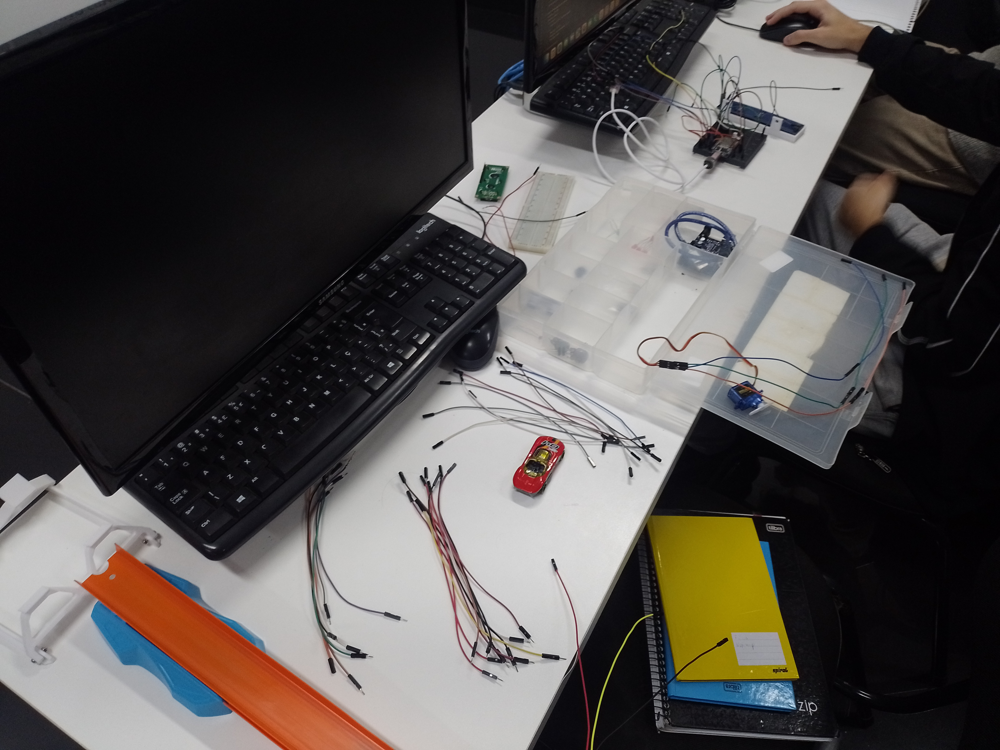
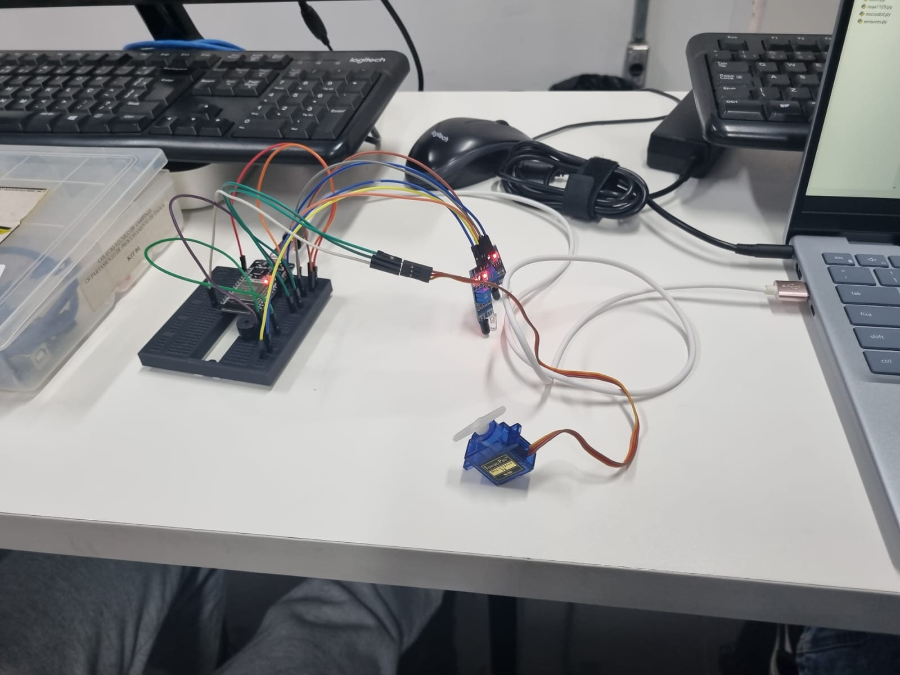
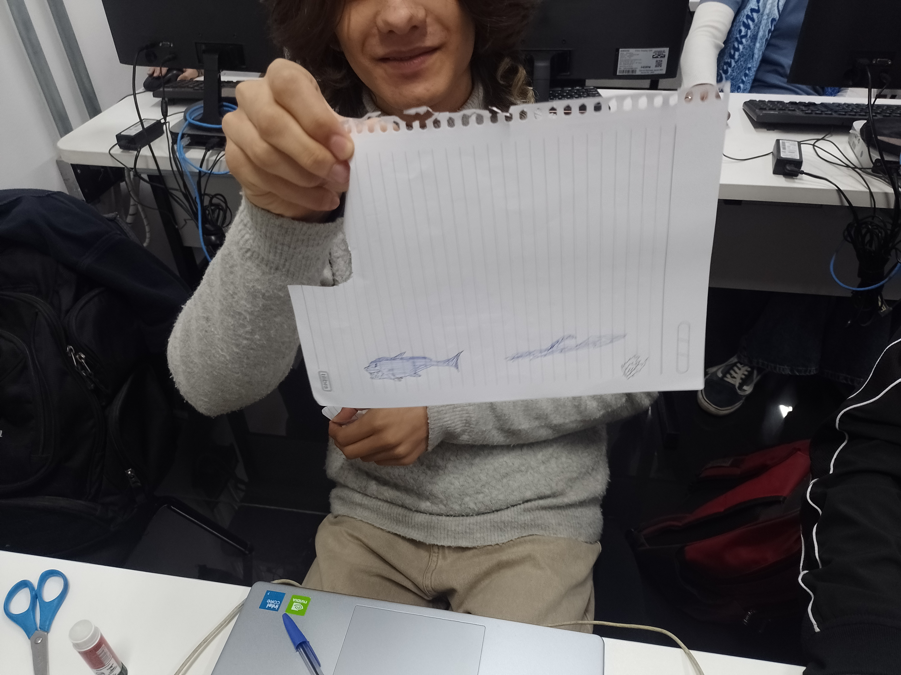
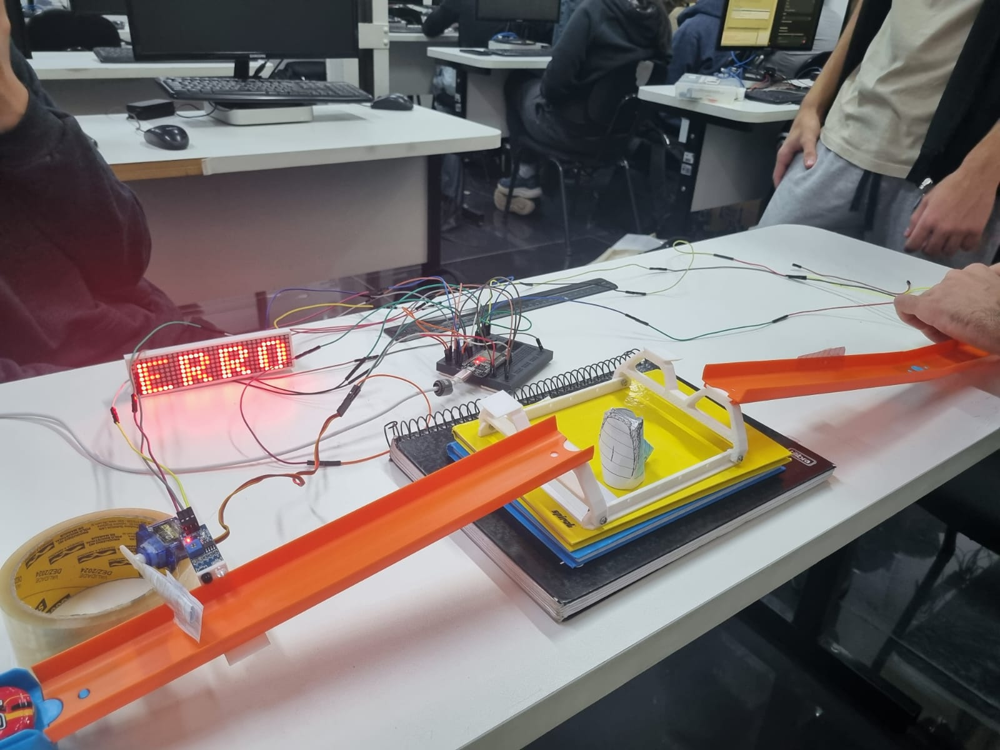
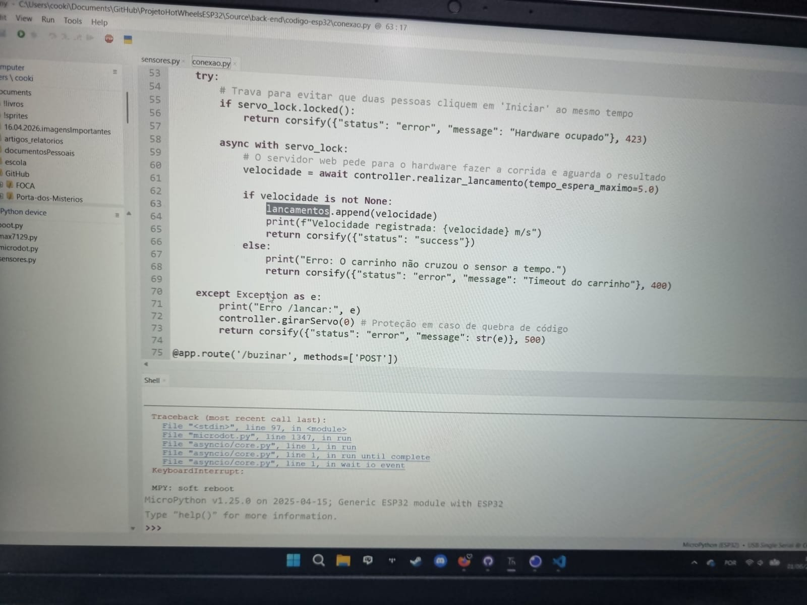
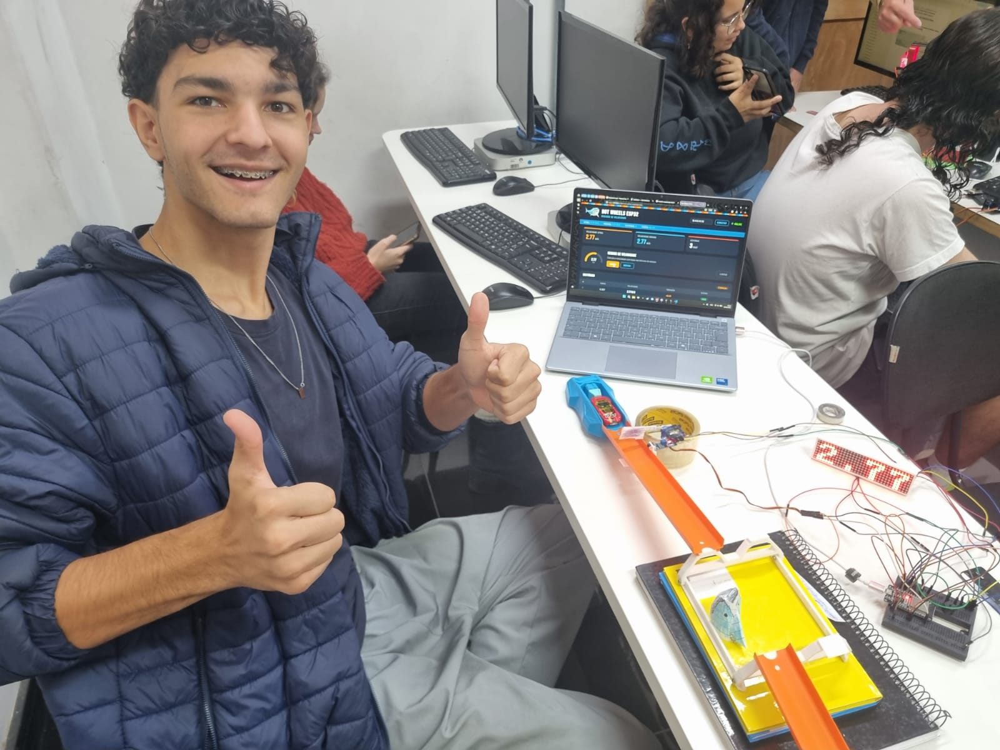
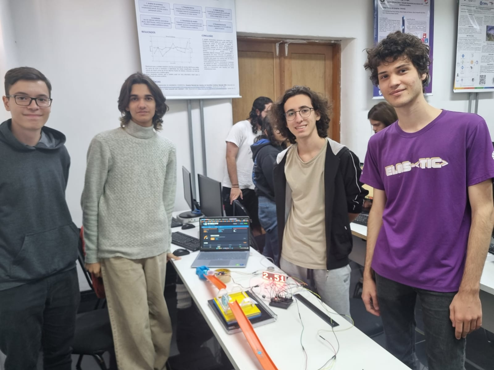

# Relatório do Projeto

## Integrantes
| Nomes | RA 
| -------- | ----- 
|Eduardo Artigiani Lima Tribst      | 24126
Júlio Pacheco Stein |24137
Luis Filipe Lima |24139
Rafael Fazion Baldin Dias | 24150   

---

## 1. Introdução do Projeto    
O projeto "Hot Wheels" tem como objetivo desenvolver um sistema de monitoramento do percurso de um carrinho de brinquedo ao longo de uma pista com um desfiladeiro no meio. O sistema ficará responsável por detectar a posição do carrinho, calcular sua velocidade e enviar esses dados para uma pagina web em tempo real, sendo possível analisar através de uma conexão wifi com o eps32.

---
## 2. Materiais Utilizados

### Hardware
Para a realização deste projeto, foram utilizados os seguintes componentes de hardware:
- Pista de brinquedo com desfiladeiro
- Lançadeira para o carrinho
- Placa de desenvolvimento ESP32
- Sensores de posição HW-201
- Paínel de led 8*8 max7219
- Buzzer
- Servo
### Software
Para a realização deste projeto foram utilizados os seguintes softwares:
- IDE Thonny para desenvolvimento do código em Python
- Biblioteca MicroPython para ESP32
- Biblioteca para controle do painel de LED MAX7219
- Servidor web para visualização dos dados em tempo real

---

## 3. Desenvolvimento do Projeto
### Metodologia
A equipe foi divida em duas frentes, uma ficou responsável pelo desenvolvimento da página web juntamente com a montagem da pista e a outra parte ficou responsável pela montagem e testes dos sensores além do código da leitura deles.

#### Planejamento
O projeto foi divido nas seguintes etapas:
- Hardware:
    1. Montagem dos sensores e outros equipamentos no simulador Wokwi
    2. Montagem e testes no esp32
    3. Desenvolvimento do código para leitura dos sensores e controle do painel de LED
- Software:
    1. Desenvolvimento do servidor web para visualização dos dados em tempo real
    2. Integração da leitura de sensores com a página web
    3. Montagem da pista

#### Controle de Versão
Durante o desenvolvimento do projeto, utilizamos o controle de versão para gerenciar as alterações no código e garantir a integridade do projeto. Utilizamos o Git como sistema de controle de versão, permitindo-nos acompanhar as mudanças, colaborar com outros membros da equipe e reverter para versões anteriores, se necessário.

---

## 4. Registros

### 4.1 Fase de Planejamento

Equipe organizada em duas frentes do projeto
### 4.2 Fase de Montagem

Montagem dos sensores HW-201 juntamente com o servo

Criação dos desenhos da pista
### 4.3 Fase de Testes

Problema de detecção de velocidade

### 4.4 Funcionamento Final

---

## 6. Conclusão

Concluímos que o projeto "Hot Wheels" foi um sucesso, alcançando os objetivos propostos de monitorar o percurso do carrinho, calcular sua velocidade e enviar os dados para uma página web em tempo real. A integração dos sensores HW-201, o controle do painel de LED MAX7219 e a implementação do servidor web por meio de conexões wi-fi utilizando o EPS32 foram fundamentais para o sucesso do projeto.

Para visualizar o resultado do projeto fizemos um vídeo no youtube explicando e demonstrando o projeto que pode ser acessado com o seguinte link: [youtu.be/yDPGKF5kBNU](https://youtu.be/yDPGKF5kBNU)
